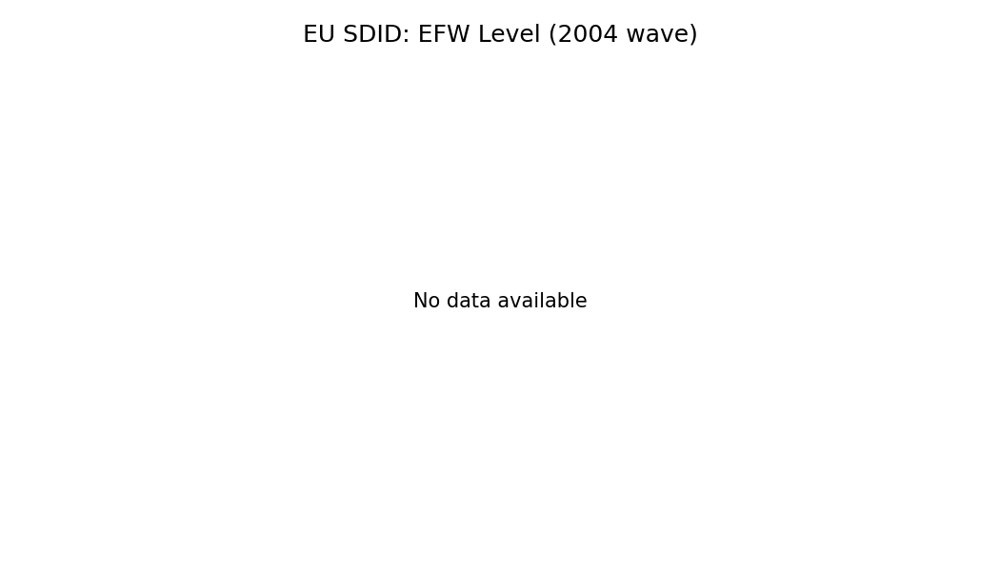
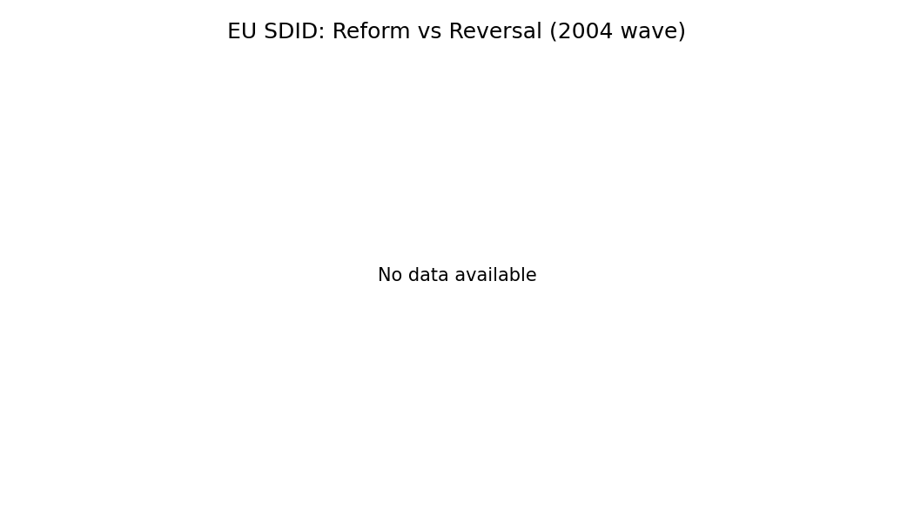
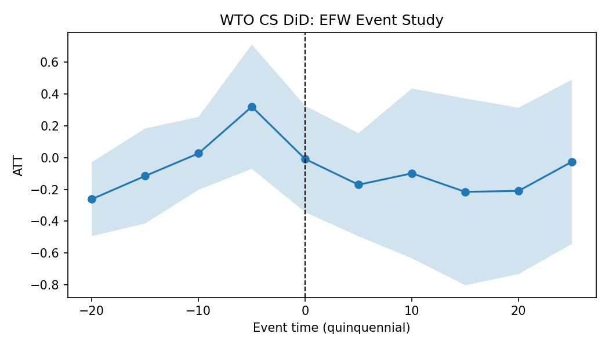

# Main Institutional Results

EU SDID event studies and reform/reversal decomposition:

WTO staggered DiD event study:

Main effects table:

See `../../outputs/tables/table_main_effects.csv`.

References:
- Economic Freedom of the World (Fraser Institute) documentation
- Arkhangelsky et al. (2021) Synth-DID
- Callaway & Sant'Anna (2021) DID; Sun & Abraham (2021) event studies
- Ben-Michael et al. (2021) Augmented SCM
- Schimmelfennig & Sedelmeier (2004) EU conditionality
- EU Commission enlargement process documentation
- Tang & Wei (2009) WTO accessions
- Brotto (IMF WP 2024) WTO accession impacts
- Chemutai & Escaith (2017) WTO commitments measurement
