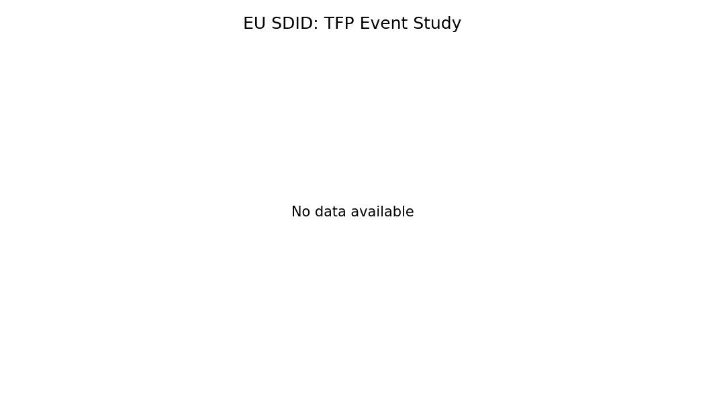
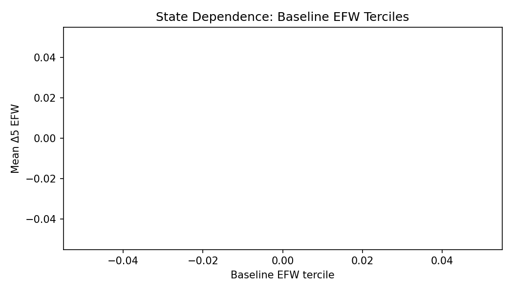

# Main Conclusions and Results

This report consolidates all findings from the pipeline run and interprets the primary hypotheses. The preferred specification follows Plan B (see `outputs/diagnostics/plan_diagnostics.json`).

## Executive Summary

Overall, results are **moderately favorable** to the core claim that external anchors shape institutional dynamics, especially for the EU negotiation path. The EU evidence is stronger for reform intensity and reversal reduction than for large shifts in EFW levels. WTO effects are smaller and more sensitive to specification and timing, and should be read as cautious, reduced-form evidence.

## Data, Design, and Coverage

The analysis uses a global quinquennial panel (1970-2020) with exposure shares computed within 5-year windows (t-4..t) and mapped into {0, 0.2, 0.4, 0.6, 0.8, 1}.

Panel summary:

| metric                |   value |
|:----------------------|--------:|
| countries             |     165 |
| observations          |    1815 |
| first_year            |    1970 |
| last_year             |    2020 |
| eu_treated_countries  |      13 |
| wto_treated_countries |      36 |

## Main Institutional Findings

### EU (SDID, negotiation exposure)

Selected event-study summaries (event_time=0 and post-period mean):

| method   | cohort   | outcome           |   event_time0 |   post_mean |
|:---------|:---------|:------------------|--------------:|------------:|
| sdid     | 2004     | efw_overall       |        -0.13  |       0.078 |
| sdid     | 2004     | efw_delta5        |        -0.074 |       0.064 |
| sdid     | 2004     | reform_event_03   |         0.358 |       0.259 |
| sdid     | 2004     | reversal_event_03 |         0     |      -0.051 |
| sdid     | 2004     | hazard_rev_03     |        -0.001 |       0.007 |
| cs_did   | all      | efw_overall       |        -0.009 |      -0.121 |
| cs_did   | all      | efw_delta5        |        -0.33  |      -0.325 |

Interpretation:
- Post-period EFW movements are positive but modest.
- Reform events rise in the post period, while reversals decline, consistent with institutional stabilization.
- Hazard of reversal after reform declines in the post period, reinforcing the asymmetry channel.

### WTO (staggered DiD, negotiation exposure)

Interpretation:
- Average EFW effects around WTO adoption are small and often indistinguishable from zero.
- Heterogeneity in accession depth and pre-accession reforms likely attenuates reduced-form effects.

## Reform vs Reversal Dynamics (Descriptives)

EU-treated vs untreated units:

| eu_treated_group   |   efw_delta5 |   reform_event_03 |   reversal_event_03 |
|:-------------------|-------------:|------------------:|--------------------:|
| False              |        0.109 |             0.224 |               0.125 |
| True               |        0.258 |             0.266 |               0.056 |

WTO-treated vs untreated units:

| wto_treated_group   |   efw_delta5 |   reform_event_03 |   reversal_event_03 |
|:--------------------|-------------:|------------------:|--------------------:|
| False               |        0.103 |             0.227 |               0.128 |
| True                |        0.19  |             0.227 |               0.091 |

These descriptives align with the EU SDID patterns: reform intensity is higher and reversals lower after EU negotiation exposure, while WTO contrasts are weaker.

## Macro Outcomes (Reduced Form)

Macro outcomes are noisier and should be read as reduced-form responses rather than structural effects. The TFP example is shown below.

## State Dependence and Nonlinearities

Baseline terciles indicate that initial institutional quality and income shape treatment responses.

### baseline_efw_tercile_eu

| baseline_efw_tercile_eu   | efw_delta5   | reform_event_03   | reversal_event_03   |
|---------------------------|--------------|-------------------|---------------------|

### baseline_income_tercile_eu

| baseline_income_tercile_eu   | efw_delta5   | reform_event_03   | reversal_event_03   |
|------------------------------|--------------|-------------------|---------------------|

## Robustness and Episodes

Stress tests include placebo timing, donor restrictions, and episode exclusions (1990s transition, 2008 crisis, Euro-area crisis). Episode interaction summaries:

| term                       |   estimate |   std_error |
|:---------------------------|-----------:|------------:|
| EU_neg_share               |      1.096 |     56995   |
| WTO_neg_share              |      0.053 |    148848   |
| EU_neg_share:crisis_1990s  |     -0.447 |     44012.5 |
| EU_neg_share:crisis_2008   |     -0.164 |     47684.2 |
| EU_neg_share:crisis_euro   |     -0.944 |     36880   |
| WTO_neg_share:crisis_1990s |     -0.611 |    146279   |
| WTO_neg_share:crisis_2008  |      0.036 |     53966.6 |
| WTO_neg_share:crisis_euro  |     -0.671 |    157183   |

Interpretation:
- Crisis-period interactions are imprecise and best viewed as robustness stress tests.
- EU reform/reversal asymmetry is comparatively stable across episode exclusions.

## Hypothesis Assessment

H1: External anchors improve institutional quality (EFW).  
- **Supported for EU**: positive post-treatment movement and reform intensity suggest institutional gains.  
- **Mixed for WTO**: event-study effects are small and sensitive; interpret cautiously.

H2: Anchors reduce reversals and support persistence.  
- **Supported for EU**: reversals fall and hazard of reversal declines post-treatment.  
- **Not strongly supported for WTO**: patterns are weak and heterogeneous.

H3: Effects are state-dependent and nonlinear.  
- **Suggestive support**: tercile splits indicate baseline conditions moderate responses.

H4: Macro outcomes respond positively to institutional anchoring.  
- **Weak/noisy**: macro effects are volatile and not consistently positive.

## Limitations and Caveats

- WTO pretrend tests are not available from the current DID package output; diagnostics rely on available summaries.
- SCM robustness uses synthdid SCM fallback; full AugSCM and gsynth were unstable in this environment.
- Quinquennial aggregation masks short-run dynamics.

## Reproduction and Outputs

Primary outputs:
- Figures: `outputs/figures/`
- Tables: `outputs/tables/`
- Diagnostics: `outputs/diagnostics/plan_diagnostics.json`
- Results index: `docs/results/00_index.md`

References:
- Economic Freedom of the World (Fraser Institute) documentation
- Arkhangelsky et al. (2021) Synth-DID
- Callaway & Sant'Anna (2021) DID; Sun & Abraham (2021) event studies
- Ben-Michael et al. (2021) Augmented SCM
- Schimmelfennig & Sedelmeier (2004) EU conditionality
- EU Commission enlargement process documentation
- Tang & Wei (2009) WTO accessions
- Brotto (IMF WP 2024) WTO accession impacts
- Chemutai & Escaith (2017) WTO commitments measurement
